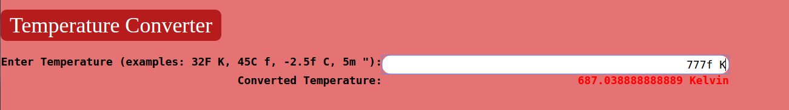
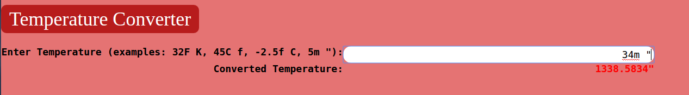

# ETSII ULL Grado de Informatica

## Práctica 6: Conversor en JavaScript de temperaturas y metros
La realización de ésta practica consiste en transcribir el código javascript del fichero temperature.js con **programación orientada a objetos**, utilizando de ésta forma los **prototype** de cada objeto para crearlo, y para heredarlo a subclases de la forma:
``
ClaseHija.prototype = new ClasePadre();
``

A continuación podemos ver varios ejemplos:
* Para el paso de Fahrenheit a Kelvin:

* Para el paso de Metros a Pulgadas:

* [Enlace al repositorio](https://github.com/ULL-ESIT-DSI-1617/programacion-orientada-a-objetos-y-herencia-en-javascript-alberto-diego-35l1-1)
* [Pagina web asignatura](https://campusvirtual.ull.es/1617/course/view.php?id=1136)
* [Enlace a la descripción de la práctica](https://casianorodriguezleon.gitbooks.io/ull-esit-1617/content/practicas/practicaoop.html)
* [Enlace al despliegue gh-pages del conversor de temperaturas](https://ull-esit-dsi-1617.github.io/programacion-orientada-a-objetos-y-herencia-en-javascript-alberto-diego-35l1-1/)
* [Enlace al despliegue del gitbook en heroku](https://enigmatic-savannah-36523.herokuapp.com/)

* [Página personal de Diego](https://alu0100761252.github.io)
* [Página personal de Alberto](https://alu0100825510.github.io)
